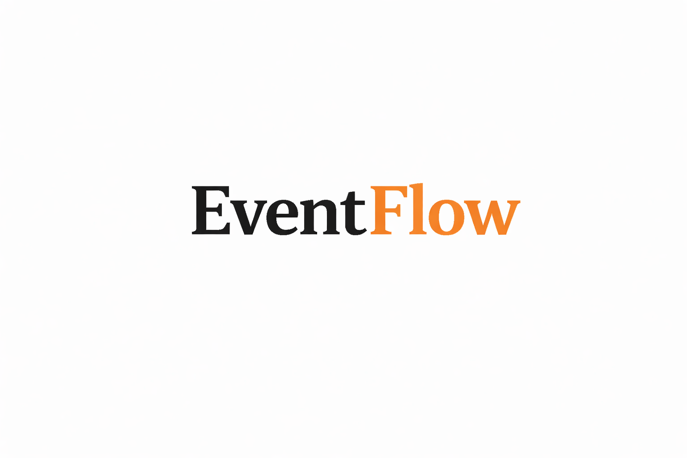
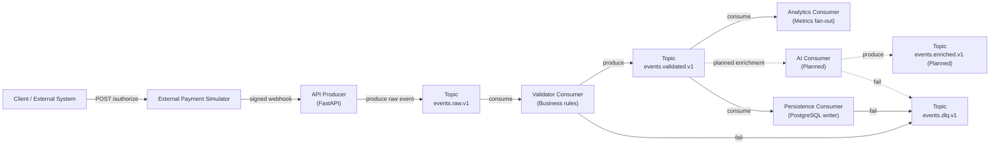

# EventFlow Platform



EventFlow is an event-driven processing platform designed to support scalable, decoupled services that communicate exclusively through Kafka.

EventFlow is designed so new processing capabilities can be added as independent consumers without modifying existing services.

Current implementation includes:

- validation
- real-time analytics metrics
- dead-letter handling
- persistence
- baseline observability with Prometheus and Grafana

Planned extensions include AI enrichment and additional downstream processors.

## Local Development

Use the reproducible runbook in [`docs/local-development.md`](docs/local-development.md).

Quickstart (from repository root):

```bash
cd infra
docker compose up -d kafka postgres prometheus grafana
cd ..

chmod +x kafka/create-topics.sh
./kafka/create-topics.sh
```

Then start all application services using the exact terminal commands in
[`docs/local-development.md`](docs/local-development.md) (Section 3, "Start Services").

Service roles:

- `services/validator-consumer` -> `python app/consumer.py`
- `services/analytics-consumer` -> `python app/consumer.py`
- `services/api-producer` -> `uvicorn app.main:app --reload`
- `services/persistent-consumer-java` -> `mvn spring-boot:run`
- `services/external-payment-simulator` -> `SIMULATOR_AUTO_STREAM_ENABLED=true uvicorn app.main:app --reload --port 8003`

Core endpoints:

- API docs: `http://localhost:8000/docs`
- Simulator docs: `http://localhost:8003/docs`
- Prometheus targets: `http://localhost:9090/targets`
- Grafana: `http://localhost:3000` (`admin` / `admin`)

## Why EventFlow Exists

Most backend systems fail not because of scale, but because change becomes dangerous.

Tightly coupled services, synchronous request chains, and shared databases make it difficult to:

- add new features
- experiment safely
- scale individual components
- reason about failures

EventFlow addresses this by making events the primary contract between services.

## Core Principles

### Event-first architecture
Events are immutable facts, not commands.

### Loose coupling
Services never call each other directly.

### Explicit message contracts
Topics and schemas are versioned and owned.

### Replayability
Past events can be reprocessed safely.

### Failure as data
Errors are captured via dead-letter topics.

### AI as a downstream capability
AI enriches data; it does not control the system.

## High-Level Architecture



## How the System Works

1. External clients submit requests via HTTP.
2. The external payment simulator generates `payment.authorized.v1` events and delivers signed webhooks.
3. The API Producer verifies signatures and publishes raw immutable events.
4. Events flow through Kafka topics, each representing a processing stage.
5. The validator consumes `events.raw.v1` and forwards valid records to `events.validated.v1`.
6. Each consumer:
   - reads events
   - performs a single responsibility
7. `events.validated.v1` currently fans out to:
   - analytics consumer (metrics)
   - persistence consumer (database write)
8. Failures are captured in a dead-letter topic, not hidden.
9. No service knows who consumes its events.

## Topics & Responsibilities

| Topic | Responsibility |
| --- | --- |
| `events.raw.v1` | Unprocessed, normalized input events |
| `events.validated.v1` | Events that passed business & schema validation |
| `events.enriched.v1` | Reserved for planned enrichment stage |
| `events.dlq.v1` | Failed events with error context |

Topics are versioned and append-only.
Schema evolution happens by creating new versions, not mutating old data.

## Consumer Groups & Scaling

- Each service owns exactly one consumer group.
- Horizontal scaling = add consumer instances.
- Kafka assigns partitions automatically.
- Ordering is guaranteed per partition.
- Slow consumers do not block the system.

Backpressure is isolated by design.

## Failure Handling

Failures are treated as first-class data.

When a consumer fails, the following are published to `events.dlq.v1`:

- the original event
- error message
- failing service name
- source topic / partition / offset
- timestamp

This enables:

- debugging without log diving
- replay & reprocessing
- operational visibility

## Technology Choices

### Kafka (KRaft mode)
No ZooKeeper, simpler local and production setups.

### FastAPI
Clean HTTP boundary and rapid iteration for producers.

### Python / Java (polyglot-ready)
Services can be rewritten without changing contracts.

### Prometheus + Grafana
Metrics-first operations for stream processing visibility.

### AWS-ready
Maps cleanly to MSK, ECS, and Bedrock AgentCore.

## Non-Goals

EventFlow intentionally avoids:

- synchronous service-to-service calls
- shared databases across services
- tight coupling through internal APIs
- AI-driven control flow

## Project Status

Implemented now:

- FastAPI API producer for `payment.authorized.v1`
- External payment simulator with webhook retries, duplicate injection, and corruption injection
- Python validator consumer with DLQ routing
- Java persistence consumer writing to PostgreSQL
- Python analytics consumer for real-time operational metrics
- Prometheus and Grafana observability stack

Next steps:

- Add enrichment consumer
- Introduce AI-driven enrichment
- Expand anomaly detection and alerting
- Expand CI with additional integration and load tests

## Observability

The local stack includes Prometheus and Grafana.

Start only observability components:

```bash
cd infra
docker compose up -d prometheus grafana
```

Endpoints:

- Prometheus: `http://localhost:9090` (use `http://localhost:9090/targets` to confirm scrapes are `UP`)
- Grafana: `http://localhost:3000` (`admin` / `admin`)
- Dashboard: `EventFlow / EventFlow Streaming Overview`
