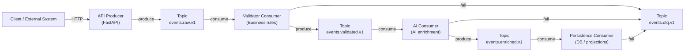

# EventFlow Platform

EventFlow is an event-driven processing platform designed to support scalable, decoupled services that communicate exclusively through Kafka.

The system enables new processing capabilities (validation, enrichment, analytics, AI, persistence) to be added without modifying existing services, reducing risk and accelerating feature delivery.

## Local Development

For local setup and end-to-end run instructions, see [`docs/local-development.md`](docs/local-development.md).

## Why EventFlow Exists

Most backend systems fail not because of scale, but because change becomes dangerous.

Tightly coupled services, synchronous request chains, and shared databases make it difficult to:

- add new features
- experiment safely
- scale individual components
- reason about failures

EventFlow addresses this by making events the primary contract between services.

## Core Principles

### Event-first architecture
Events are immutable facts, not commands.

### Loose coupling
Services never call each other directly.

### Explicit message contracts
Topics and schemas are versioned and owned.

### Replayability
Past events can be reprocessed safely.

### Failure as data
Errors are captured via dead-letter topics.

### AI as a downstream capability
AI enriches data; it does not control the system.

## High-Level Architecture

## How the System Works

1. External clients submit requests via HTTP.
2. The API Producer validates input and publishes immutable events.
3. Events flow through Kafka topics, each representing a processing stage.
4. Consumers subscribe using their own consumer groups.
5. Each consumer:
   - reads events
   - performs a single responsibility
   - emits a new event
6. Failures are captured in a dead-letter topic, not hidden.
7. No service knows who consumes its events.

## Topics & Responsibilities

| Topic | Responsibility |
| --- | --- |
| `events.raw.v1` | Unprocessed, normalized input events |
| `events.validated.v1` | Events that passed business & schema validation |
| `events.enriched.v1` | Events enriched with AI or external data |
| `events.dlq.v1` | Failed events with error context |

Topics are versioned and append-only.
Schema evolution happens by creating new versions, not mutating old data.

## Consumer Groups & Scaling

- Each service owns exactly one consumer group.
- Horizontal scaling = add consumer instances.
- Kafka assigns partitions automatically.
- Ordering is guaranteed per partition.
- Slow consumers do not block the system.

Backpressure is isolated by design.

## Failure Handling

Failures are treated as first-class data.

When a consumer fails, the following are published to `events.dlq.v1`:

- the original event
- error message
- stack trace
- failing service name
- timestamp

This enables:

- debugging without log diving
- replay & reprocessing
- operational visibility

## Technology Choices

### Kafka (KRaft mode)
No ZooKeeper, simpler local and production setups.

### FastAPI
Clean HTTP boundary and rapid iteration for producers.

### Python / Java (polyglot-ready)
Services can be rewritten without changing contracts.

### AWS-ready
Maps cleanly to MSK, ECS, and Bedrock AgentCore.

## Non-Goals

EventFlow intentionally avoids:

- synchronous service-to-service calls
- shared databases across services
- tight coupling through internal APIs
- AI-driven control flow

## Project Status

Architectural foundation complete.

Next steps:

- Implement API producer
- Add validator consumer
- Define event schemas
- Introduce AI enrichment
- Expand observability

## Local Deevelopment

chmod +x kafka/create-topics.sh
